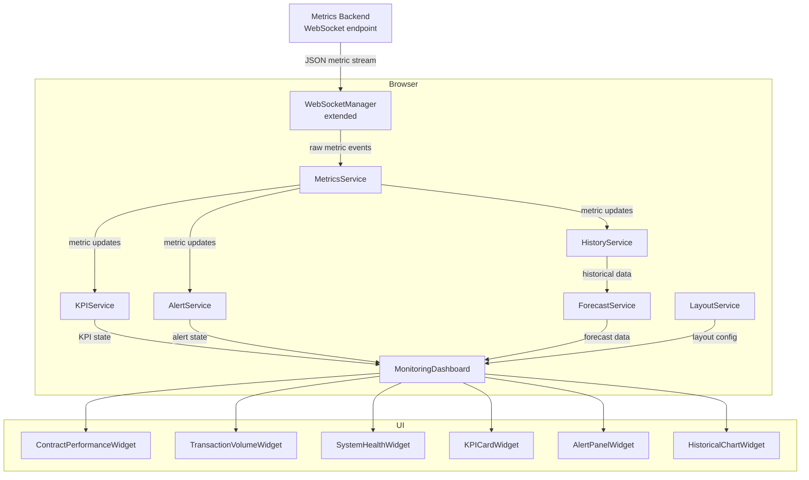
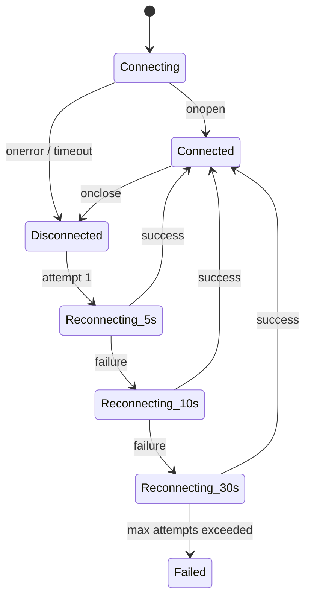

# Design Document: Real-Time Monitoring Dashboard

## Overview

The Real-Time Monitoring Dashboard adds a live observability layer to the Fidelis Soroban DApp. It gives operators and developers a single pane of glass for tracking Soroban contract performance, transaction volumes, system health, custom KPIs, and alerts — all updating in real time via WebSocket.

The feature is built entirely within the existing React/TypeScript/Vite frontend. It extends the existing `WebSocketManager`, `VisualizationManager`, `NotificationManager`, and `StorageService` rather than replacing them. New domain services (metrics, KPI, alert, forecast, history) are added under `src/services/monitoring/`. New UI components live under `src/components/monitoring/`.

Data persistence uses IndexedDB (via the existing `idb` library) for historical time-series storage and layout persistence. The WebSocket connection to a backend metrics endpoint delivers live metric updates. Forecasting uses simple linear regression computed in-browser.

---

## Architecture



### Key Design Decisions

- **WebSocket-first, polling fallback**: The existing `WebSocketManager` is extended with the required reconnection schedule (5s, 10s, 30s) and a connection-status event. Polling at 5-second intervals serves as a fallback when WebSocket is unavailable.
- **In-browser time-series store**: `HistoryService` writes every metric data point to IndexedDB with a TTL of 30 days. Queries are served from IndexedDB, avoiding a separate backend query endpoint for historical data.
- **In-browser forecasting**: `ForecastService` runs linear regression over the last N data points entirely in the browser. No ML backend is required.
- **Trend computation**: Linear regression slope determines Improving / Stable / Degrading direction. Computed on each chart refresh when ≥ 10 data points are present.
- **Alert deduplication**: `AlertService` maintains an in-memory map of active alerts keyed by `alertRuleId`. Duplicate triggers increment a `repeatCount` field rather than creating new alert records.
- **Layout persistence**: Widget positions and configurations are serialized to IndexedDB via the existing `VisualizationManager.saveDashboard` / `getDashboard` API.

---

## Components and Interfaces

### Service Layer (`src/services/monitoring/`)

#### `MetricsService`
Central hub that receives raw WebSocket events and distributes typed `MetricUpdate` objects to subscribers.

```typescript
interface MetricUpdate {
  metricName: string;
  contractId?: string;
  value: number;
  timestamp: number;
  unit?: string;
}

interface MetricsService {
  subscribe(metricName: string, cb: (update: MetricUpdate) => void): () => void;
  getLatest(metricName: string): MetricUpdate | undefined;
  getLatestAll(): Map<string, MetricUpdate>;
}
```

#### `KPIService`
Manages CRUD for user-defined KPIs and evaluates progress toward targets.

```typescript
interface KPI {
  id: string;
  name: string;
  sourceMetric: string;
  targetValue: number;
  threshold?: Threshold;
  createdAt: number;
}

interface Threshold {
  value: number;
  operator: 'above' | 'below';
}

interface KPIState extends KPI {
  currentValue: number;
  progressPercent: number;
}

interface KPIService {
  createKPI(kpi: Omit<KPI, 'id' | 'createdAt'>): Promise<KPI>;
  deleteKPI(id: string): Promise<void>;
  listKPIs(): Promise<KPI[]>;
  getKPIState(id: string): KPIState | undefined;
}
```

#### `AlertService`
Evaluates alert rules against incoming metric updates and manages the active alert list.

```typescript
type AlertSeverity = 'warning' | 'critical';
type AlertStatus = 'active' | 'resolved';

interface AlertRule {
  id: string;
  targetMetric: string;
  threshold: Threshold;
  channels: NotificationChannel[];
  createdAt: number;
}

interface Alert {
  id: string;
  ruleId: string;
  metricName: string;
  severity: AlertSeverity;
  status: AlertStatus;
  triggeredAt: number;
  resolvedAt?: number;
  repeatCount: number;
  value: number;
}

interface AlertService {
  createRule(rule: Omit<AlertRule, 'id' | 'createdAt'>): Promise<AlertRule>;
  deleteRule(id: string): Promise<void>;
  getActiveAlerts(): Alert[];
  onAlert(cb: (alert: Alert) => void): () => void;
}
```

#### `HistoryService`
Persists time-series data to IndexedDB and serves range queries.

```typescript
interface HistoryQuery {
  metricName: string;
  startTime: number;
  endTime: number;
}

interface HistoryService {
  record(update: MetricUpdate): Promise<void>;
  query(q: HistoryQuery): Promise<DataPoint[]>;
  exportCSV(q: HistoryQuery): Promise<string>;
  pruneOlderThan(cutoffMs: number): Promise<void>;
}
```

#### `ForecastService`
Computes linear regression forecasts from historical data.

```typescript
interface ForecastHorizon {
  hours: 1 | 6 | 24;
  predictedValue: number;
  confidenceLow: number;
  confidenceHigh: number;
}

interface ForecastResult {
  metricName: string;
  horizons: ForecastHorizon[];
  computedAt: number;
  dataPointCount: number;
  insufficientData: boolean; // true when < 24h of history
}

interface ForecastService {
  getForecast(metricName: string): ForecastResult | undefined;
  recompute(metricName: string): Promise<ForecastResult>;
}
```

#### `LayoutService`
Persists and restores dashboard widget layouts.

```typescript
interface WidgetConfig {
  id: string;
  type: 'line-chart' | 'bar-chart' | 'kpi-card' | 'alert-list' | 'health-panel';
  title: string;
  dataSource: string;
  timeRange?: string;
  position: { x: number; y: number; w: number; h: number };
}

interface LayoutService {
  saveLayout(widgets: WidgetConfig[]): Promise<void>;
  loadLayout(): Promise<WidgetConfig[]>;
  resetToDefault(): Promise<void>;
}
```

### UI Components (`src/components/monitoring/`)

| Component | Responsibility |
|---|---|
| `MonitoringDashboard` | Root container; owns layout state, drag-and-drop grid |
| `ContractPerformanceWidget` | Displays invocation count, median/p95 latency, error rate per contract |
| `TransactionVolumeWidget` | Time-series bar/line chart with time-window selector |
| `SystemHealthWidget` | Status grid (Healthy / Degraded / Unavailable) with uptime elapsed |
| `KPICardWidget` | Numeric KPI card with progress bar and threshold indicator |
| `AlertPanelWidget` | Sorted alert list with severity badges and resolution status |
| `HistoricalChartWidget` | Line chart with trend overlay, forecast dashed line, CSV export |
| `ConnectionStatusBanner` | Sticky banner shown when Data_Feed is disconnected |
| `KPIForm` | Create/edit KPI modal |
| `AlertRuleForm` | Create/edit alert rule modal |
| `WidgetConfigPanel` | Sidebar for configuring a selected widget's data source and title |

---

## Data Models

### IndexedDB Schema Extension

The existing `FidelisDBSchema` (in `src/services/storage/schema.ts`) is extended with three new object stores:

```typescript
interface MonitoringDBSchema extends FidelisDBSchema {
  // Time-series metric records — keyed by [metricName, timestamp]
  metricHistory: {
    key: [string, number];
    value: {
      metricName: string;
      contractId?: string;
      value: number;
      timestamp: number;
      unit?: string;
    };
    indexes: {
      'by-metric-time': [string, number];
      'by-timestamp': number;
    };
  };

  // User-defined KPIs
  kpis: {
    key: string; // KPI id
    value: KPI;
    indexes: { 'by-created': number };
  };

  // Alert rules
  alertRules: {
    key: string; // AlertRule id
    value: AlertRule;
  };

  // Active and resolved alerts
  alerts: {
    key: string; // Alert id
    value: Alert;
    indexes: {
      'by-rule': string;
      'by-status': AlertStatus;
      'by-triggered': number;
    };
  };
}
```

### In-Memory State

`MetricsService` maintains a `Map<string, MetricUpdate>` of the latest value per metric name. This is the source of truth for live widget rendering and is never persisted directly (IndexedDB holds the history).

`AlertService` maintains a `Map<string, Alert>` of currently active alerts keyed by `ruleId` for O(1) deduplication lookups.

### WebSocket Message Protocol Extension

The existing `WebSocketMessage` type is extended to include monitoring-specific message types:

```typescript
type MonitoringMessageType =
  | 'metric'        // generic metric update
  | 'contract_perf' // contract performance snapshot
  | 'tx_volume'     // transaction volume tick
  | 'system_health' // component health status change
  | 'price'         // existing
  | 'transaction'   // existing
  | 'balance';      // existing

interface MonitoringWebSocketMessage {
  type: MonitoringMessageType;
  data: Record<string, unknown>;
  timestamp: number;
}
```

### Reconnection State Machine



---
